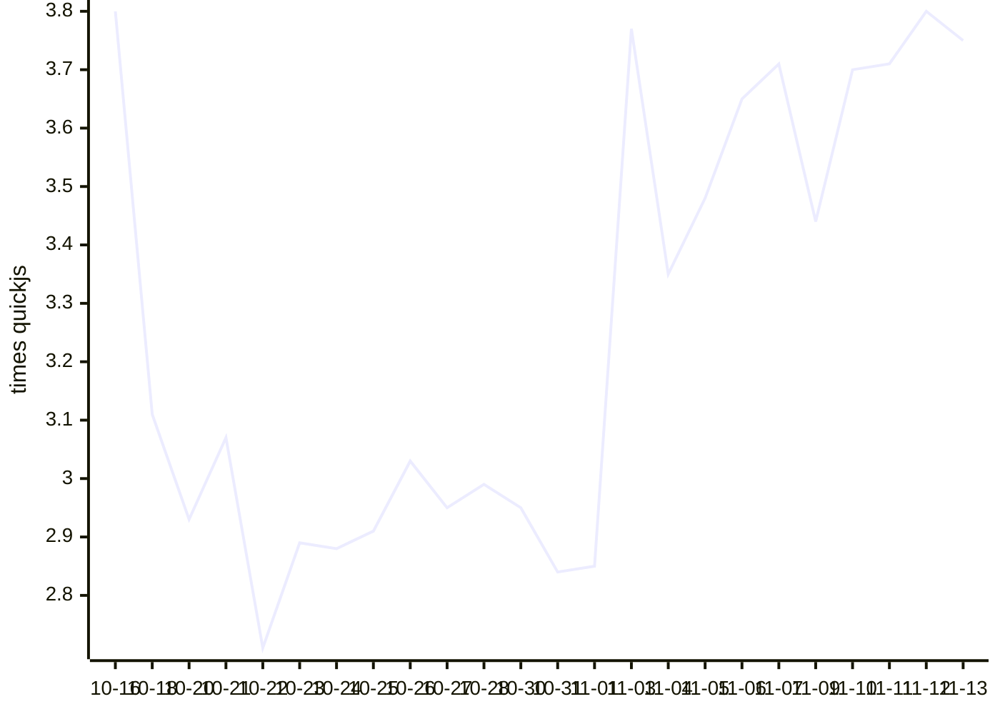

# Kahvi benchmark results

Written by `.github/workflows/bench.yml` from `bench/run.py` (see `bench/README.md` on main). Times are medians of wall time on a GitHub-hosted runner; ratios compare each engine with quickjs measured in the same run, so lower is faster.

## Kahvi over time

Geometric mean of Kahvi's time relative to quickjs, across the workloads both ran. Lower is faster.

```mermaid
xychart-beta
  x-axis ["10-16", "10-18", "10-20", "10-21", "10-22", "10-23", "10-24", "10-25", "10-26", "10-27", "10-28", "10-30", "10-31", "11-01", "11-03", "11-04", "11-05", "11-06", "11-07", "11-09", "11-10", "11-11", "11-12", "11-13"]
  y-axis "times quickjs"
  line [3.80, 3.11, 2.93, 3.07, 2.71, 2.89, 2.88, 2.91, 3.03, 2.95, 2.99, 2.95, 2.84, 2.85, 3.77, 3.35, 3.48, 3.65, 3.71, 3.44, 3.70, 3.71, 3.80, 3.75]
```

## Latest run: 2026-11-13T09:36:46Z

Kahvi git 16a110e, 3 runs each, on Linux-7.0.0-1016-aws-x86_64-with-glibc2.43, Linux-7.0.0-1019-azure-x86_64-with-glibc2.43.

| Workload | kahvi | node | node-jitless | quickjs | boa | hermes |
|---|---|---|---|---|---|---|
| startup/empty | 0.003s (2.727x) | 0.026s (12.619x) | 0.026s (12.524x) | 0.002s | 0.012s (5.905x) | 0.004s (1.952x) |
| octane/richards | 6.093s (4.584x) | 0.059s (0.038x) | 0.565s (0.425x) | 1.329s | 7.179s (4.714x) | 0.793s (0.521x) |
| octane/deltablue | 7.926s (4.805x) | 0.066s (0.047x) | 0.829s (0.502x) | 1.649s | 7.741s (5.479x) | 0.869s (0.615x) |
| octane/crypto | 19.181s (3.52x) | 0.151s (0.028x) | 3.721s (0.683x) | 5.449s | 25.965s (4.825x) | 3.016s (0.561x) |
| octane/raytrace | 11.056s (4.134x) | 0.111s (0.049x) | 0.999s (0.373x) | 2.675s | 11.559s (5.1x) | 1.614s (0.712x) |
| octane/earley-boyer | 27.127s (4.355x) | 0.215s (0.055x) | 2.140s (0.344x) | 6.229s | 28.162s (7.196x) | 2.509s (0.641x) |
| octane/regexp | 12.199s (3.773x) | 0.162s (0.054x) | 0.492s (0.152x) | 3.233s | 22.593s (7.553x) | 1.830s (0.612x) |
| octane/splay | 1.310s (2.588x) | 0.173s (0.263x) | 0.323s (0.489x) | 0.660s | 2.343s (3.55x) | 0.474s (0.718x) |
| octane/navier-stokes | 6.927s (3.976x) | 0.124s (0.073x) | 1.724s (1.016x) | 1.697s | 8.319s (4.902x) | 1.483s (0.874x) |
| realworld/acorn | 3.762s | 0.201s | 0.625s | – | – | – |
| realworld/marked | 1.016s | 0.104s | 0.131s | – | – | – |
| realworld/prettier | 11.934s | 0.532s | 1.548s | – | – | – |
| realworld/terser | 10.372s | 0.611s | 1.280s | – | – | – |

| Engine | Version |
|---|---|
| kahvi | git 16a110e |
| node | v24.22.3 |
| node-jitless | v24.22.3 |
| quickjs | 0.18.0 |
| boa | boa 0.22.0 |
| hermes | LLVM (http://llvm.org/): |

## History

| Date | Kahvi commit | Kahvi vs quickjs (geomean) | Workloads | File |
|---|---|---|---|---|
| 2026-11-13T09:36:46Z | git 16a110e | 3.75x | 9 | [json](results/20261113T093646Z-16a110ed67.json) |
| 2026-11-12T09:54:03Z | git 966f56b | 3.80x | 9 | [json](results/20261112T095403Z-966f56bce0.json) |
| 2026-11-11T09:30:33Z | git deec975 | 3.71x | 9 | [json](results/20261111T093033Z-deec975782.json) |
| 2026-11-10T09:56:08Z | git d130077 | 3.70x | 9 | [json](results/20261110T095608Z-d13007748a.json) |
| 2026-11-09T09:53:46Z | git 0ee82a5 | 3.44x | 9 | [json](results/20261109T095346Z-0ee82a5dcc.json) |
| 2026-11-07T08:51:32Z | git bee1b4e | 3.71x | 9 | [json](results/20261107T085132Z-bee1b4ebd9.json) |
| 2026-11-06T09:28:43Z | git c91b8e8 | 3.65x | 9 | [json](results/20261106T092843Z-c91b8e8d8b.json) |
| 2026-11-05T09:34:11Z | git 663f862 | 3.48x | 9 | [json](results/20261105T093411Z-663f862552.json) |
| 2026-11-04T09:22:01Z | git 98ed7da | 3.35x | 9 | [json](results/20261104T092201Z-98ed7da385.json) |
| 2026-11-03T09:38:44Z | git b236288 | 3.77x | 9 | [json](results/20261103T093844Z-b236288e30.json) |
| 2026-11-01T09:20:36Z | git 100ced3 | 2.85x | 9 | [json](results/20261101T092036Z-100ced3d4d.json) |
| 2026-10-31T08:29:36Z | git a3dc6de | 2.84x | 9 | [json](results/20261031T082936Z-a3dc6de88e.json) |
| 2026-10-30T08:43:18Z | git b75ecfe | 2.95x | 9 | [json](results/20261030T084318Z-b75ecfe641.json) |
| 2026-10-28T08:39:01Z | git 1a1d9f0 | 2.99x | 9 | [json](results/20261028T083901Z-1a1d9f0872.json) |
| 2026-10-27T07:57:12Z | git ab18b24 | 2.95x | 9 | [json](results/20261027T075712Z-ab18b2476d.json) |
| 2026-10-26T07:52:02Z | git 006e586 | 3.03x | 9 | [json](results/20261026T075202Z-006e58682a.json) |
| 2026-10-25T07:38:52Z | git 0614530 | 2.91x | 9 | [json](results/20261025T073852Z-06145300cb.json) |
| 2026-10-24T07:22:14Z | git 965eed5 | 2.88x | 9 | [json](results/20261024T072214Z-965eed51be.json) |
| 2026-10-23T07:37:01Z | git 7071998 | 2.89x | 9 | [json](results/20261023T073701Z-707199806e.json) |
| 2026-10-22T07:39:32Z | git f9066d9 | 2.71x | 9 | [json](results/20261022T073932Z-f9066d9e0c.json) |
| 2026-10-21T07:43:58Z | git 6195d71 | 3.07x | 9 | [json](results/20261021T074358Z-6195d71ab0.json) |
| 2026-10-20T07:39:19Z | git 34ce57b | 2.93x | 9 | [json](results/20261020T073919Z-34ce57be6c.json) |
| 2026-10-18T07:16:59Z | git e8d4c59 | 3.11x | 9 | [json](results/20261018T071659Z-e8d4c59b8e.json) |
| 2026-10-16T07:15:56Z | git 36694ea | 3.80x | 9 | [json](results/20261016T071556Z-36694eab43.json) |
