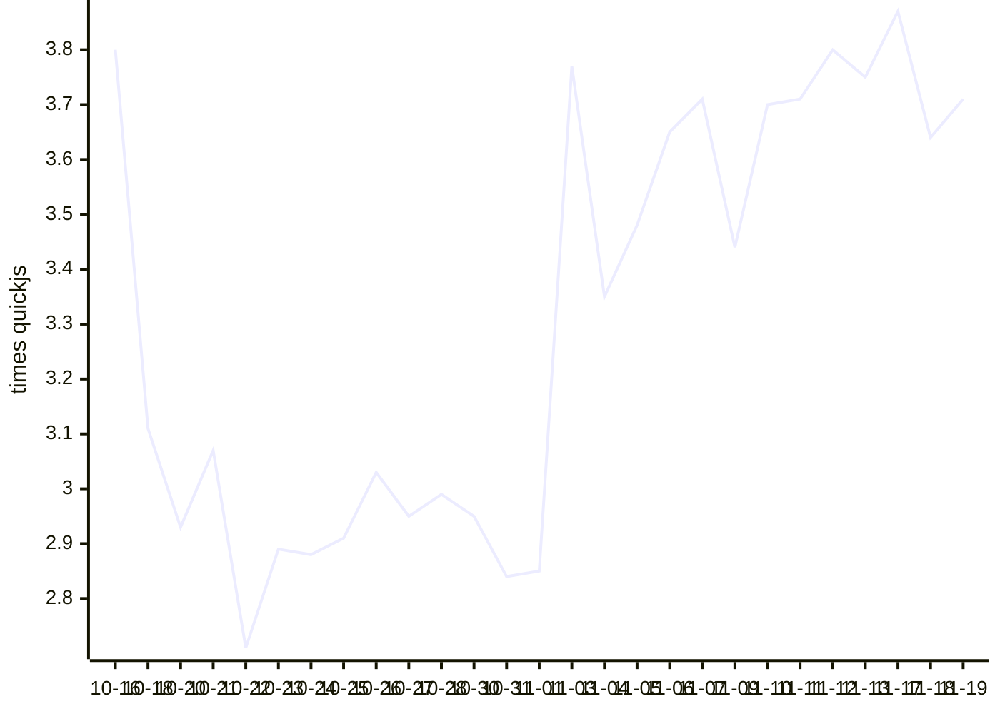

# Kahvi benchmark results

Written by `.github/workflows/bench.yml` from `bench/run.py` (see `bench/README.md` on main). Times are medians of wall time on a GitHub-hosted runner; ratios compare each engine with quickjs measured in the same run, so lower is faster.

## Kahvi over time

Geometric mean of Kahvi's time relative to quickjs, across the workloads both ran. Lower is faster.

```mermaid
xychart-beta
  x-axis ["10-16", "10-18", "10-20", "10-21", "10-22", "10-23", "10-24", "10-25", "10-26", "10-27", "10-28", "10-30", "10-31", "11-01", "11-03", "11-04", "11-05", "11-06", "11-07", "11-09", "11-10", "11-11", "11-12", "11-13", "11-17", "11-18", "11-19"]
  y-axis "times quickjs"
  line [3.80, 3.11, 2.93, 3.07, 2.71, 2.89, 2.88, 2.91, 3.03, 2.95, 2.99, 2.95, 2.84, 2.85, 3.77, 3.35, 3.48, 3.65, 3.71, 3.44, 3.70, 3.71, 3.80, 3.75, 3.87, 3.64, 3.71]
```

## Latest run: 2026-11-19T10:26:04Z

Kahvi git 5e23fb5, 3 runs each, on Linux-7.0.0-1016-aws-x86_64-with-glibc2.43, Linux-7.0.0-1019-azure-x86_64-with-glibc2.43, Linux-7.0.0-1020-azure-x86_64-with-glibc2.43.

| Workload | kahvi | node | node-jitless | quickjs | boa | hermes |
|---|---|---|---|---|---|---|
| startup/empty | 0.003s (2.273x) | 0.020s (18.182x) | 0.018s (16.182x) | 0.001s | 0.007s (6.182x) | 0.002s (1.727x) |
| octane/richards | 6.052s (4.685x) | 0.086s (0.037x) | 0.600s (0.465x) | 1.292s | 11.166s (4.759x) | 1.280s (0.546x) |
| octane/deltablue | 6.661s (4.703x) | 0.095s (0.041x) | 0.679s (0.48x) | 1.416s | 12.343s (5.289x) | 1.377s (0.59x) |
| octane/crypto | 12.555s (4.173x) | 0.180s (0.038x) | 2.216s (0.737x) | 3.009s | 28.736s (6.022x) | 2.971s (0.623x) |
| octane/raytrace | 8.747s (3.886x) | 0.157s (0.044x) | 0.841s (0.374x) | 2.251s | 18.523s (5.155x) | 2.896s (0.806x) |
| octane/earley-boyer | 26.837s (4.918x) | 0.328s (0.057x) | 1.750s (0.321x) | 5.456s | 41.139s (7.114x) | 3.574s (0.618x) |
| octane/regexp | 11.966s (3.753x) | 0.294s (0.044x) | 0.535s (0.168x) | 3.188s | 43.568s (6.532x) | 3.453s (0.518x) |
| octane/splay | 1.027s (2.235x) | 0.115s (0.271x) | 0.195s (0.458x) | 0.426s | 1.468s (3.448x) | 0.319s (0.75x) |
| octane/navier-stokes | 5.808s (4.014x) | 0.093s (0.102x) | 1.146s (1.26x) | 0.909s | 5.106s (5.615x) | 0.846s (0.93x) |
| realworld/acorn | 2.860s | 0.127s | 0.441s | – | – | – |
| realworld/marked | 0.785s | 0.074s | 0.088s | – | – | – |
| realworld/prettier | 9.642s | 0.330s | 0.971s | – | – | – |
| realworld/terser | 8.522s | 0.375s | 0.816s | – | – | – |

| Engine | Version |
|---|---|
| kahvi | git 5e23fb5 |
| node | v24.22.2 |
| node-jitless | v24.22.2 |
| quickjs | 0.18.0 |
| boa | boa 0.22.0 |
| hermes | LLVM (http://llvm.org/): |

## History

| Date | Kahvi commit | Kahvi vs quickjs (geomean) | Workloads | File |
|---|---|---|---|---|
| 2026-11-19T10:26:04Z | git 5e23fb5 | 3.71x | 9 | [json](results/20261119T102604Z-5e23fb5cde.json) |
| 2026-11-18T10:15:15Z | git c7424bf | 3.64x | 9 | [json](results/20261118T101515Z-c7424bf654.json) |
| 2026-11-17T10:47:26Z | git d48bd0d | 3.87x | 9 | [json](results/20261117T104726Z-d48bd0d693.json) |
| 2026-11-13T09:36:46Z | git 16a110e | 3.75x | 9 | [json](results/20261113T093646Z-16a110ed67.json) |
| 2026-11-12T09:54:03Z | git 966f56b | 3.80x | 9 | [json](results/20261112T095403Z-966f56bce0.json) |
| 2026-11-11T09:30:33Z | git deec975 | 3.71x | 9 | [json](results/20261111T093033Z-deec975782.json) |
| 2026-11-10T09:56:08Z | git d130077 | 3.70x | 9 | [json](results/20261110T095608Z-d13007748a.json) |
| 2026-11-09T09:53:46Z | git 0ee82a5 | 3.44x | 9 | [json](results/20261109T095346Z-0ee82a5dcc.json) |
| 2026-11-07T08:51:32Z | git bee1b4e | 3.71x | 9 | [json](results/20261107T085132Z-bee1b4ebd9.json) |
| 2026-11-06T09:28:43Z | git c91b8e8 | 3.65x | 9 | [json](results/20261106T092843Z-c91b8e8d8b.json) |
| 2026-11-05T09:34:11Z | git 663f862 | 3.48x | 9 | [json](results/20261105T093411Z-663f862552.json) |
| 2026-11-04T09:22:01Z | git 98ed7da | 3.35x | 9 | [json](results/20261104T092201Z-98ed7da385.json) |
| 2026-11-03T09:38:44Z | git b236288 | 3.77x | 9 | [json](results/20261103T093844Z-b236288e30.json) |
| 2026-11-01T09:20:36Z | git 100ced3 | 2.85x | 9 | [json](results/20261101T092036Z-100ced3d4d.json) |
| 2026-10-31T08:29:36Z | git a3dc6de | 2.84x | 9 | [json](results/20261031T082936Z-a3dc6de88e.json) |
| 2026-10-30T08:43:18Z | git b75ecfe | 2.95x | 9 | [json](results/20261030T084318Z-b75ecfe641.json) |
| 2026-10-28T08:39:01Z | git 1a1d9f0 | 2.99x | 9 | [json](results/20261028T083901Z-1a1d9f0872.json) |
| 2026-10-27T07:57:12Z | git ab18b24 | 2.95x | 9 | [json](results/20261027T075712Z-ab18b2476d.json) |
| 2026-10-26T07:52:02Z | git 006e586 | 3.03x | 9 | [json](results/20261026T075202Z-006e58682a.json) |
| 2026-10-25T07:38:52Z | git 0614530 | 2.91x | 9 | [json](results/20261025T073852Z-06145300cb.json) |
| 2026-10-24T07:22:14Z | git 965eed5 | 2.88x | 9 | [json](results/20261024T072214Z-965eed51be.json) |
| 2026-10-23T07:37:01Z | git 7071998 | 2.89x | 9 | [json](results/20261023T073701Z-707199806e.json) |
| 2026-10-22T07:39:32Z | git f9066d9 | 2.71x | 9 | [json](results/20261022T073932Z-f9066d9e0c.json) |
| 2026-10-21T07:43:58Z | git 6195d71 | 3.07x | 9 | [json](results/20261021T074358Z-6195d71ab0.json) |
| 2026-10-20T07:39:19Z | git 34ce57b | 2.93x | 9 | [json](results/20261020T073919Z-34ce57be6c.json) |
| 2026-10-18T07:16:59Z | git e8d4c59 | 3.11x | 9 | [json](results/20261018T071659Z-e8d4c59b8e.json) |
| 2026-10-16T07:15:56Z | git 36694ea | 3.80x | 9 | [json](results/20261016T071556Z-36694eab43.json) |
